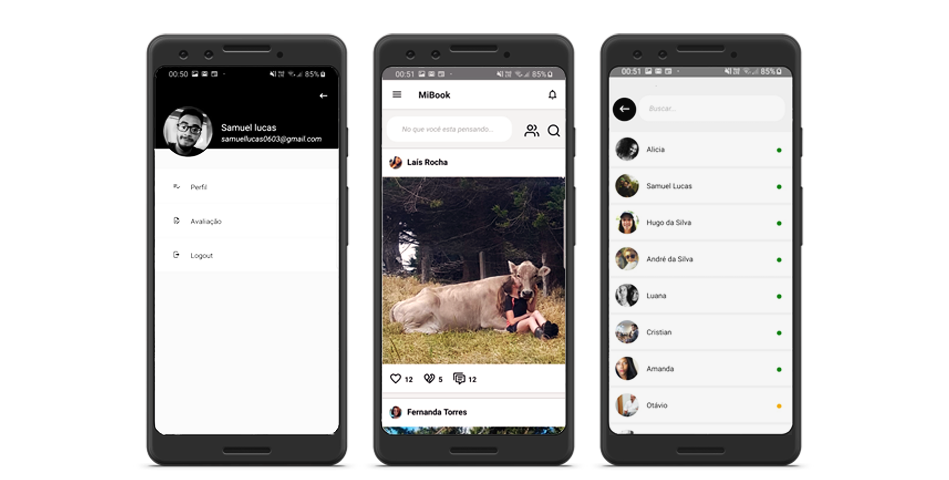

<h1 align="center">   
    :cow: MiBook
</h1>

<h4 align="center">
  Hackathon AgroUp Inatel - 2019
</h4>

  <a href="#rocket-tecnologias">Tecnologias</a>&nbsp;&nbsp;&nbsp;|&nbsp;&nbsp;&nbsp;
  <a href="#computer-projeto">Projeto</a>&nbsp;&nbsp;&nbsp;|&nbsp;&nbsp;&nbsp;
  <a href="#pencil-layout">Layout</a>&nbsp;&nbsp;&nbsp;|&nbsp;&nbsp;&nbsp;
  <a href="#octocat-contato">Como contribuir</a>&nbsp;&nbsp;&nbsp;|&nbsp;&nbsp;&nbsp;
  <a href="#postbox-contato">Contato</a>&nbsp;&nbsp;&nbsp;

  

## :rocket: Tecnologias

Esse projeto foi desenvolvido com [React Native](https://facebook.github.io/react-native/).

## :computer: Projeto

O MiBook é um projeto que propõem a interação entre os produtores rurais para troca de experiencias, em geral, além do mais o projeto apresenta um cadastro de dados visando o maior controle de dados do gado. O projeto foi desenvolvido no Hackton AgroUp Inatel no ano de 2019 e não tem nenhuma conexão com banco de dados. O projeto é apenas um protótipo das paginas que o produto final teria.

## :pencil: Layout

Não foi desenvolvido nenhum Layout antes do projeto ser desenvolvido.

## :octocat: Como contribuir

Siga os passos abaixo para fazer sua contribuição:

- Faça um fork desse repositório;
- Cria uma branch com a sua feature: `git checkout -b minha-feature`;
- Faça commit das suas alterações: `git commit -m 'feat: Minha nova feature'`;
- Faça push para a sua branch: `git push origin minha-feature`.

Depois que o merge da sua pull request for feito, você pode deletar a sua branch.

## :postbox: Contato

 Para mais informações entre em contato:

- [Facebook](https://www.facebook.com/samuellucassantosgomes);
- [Linkedin](https://www.linkedin.com/in/samuel-lucas-8b7297125/);

---

Feito com ♥ by Samuel Lucas
